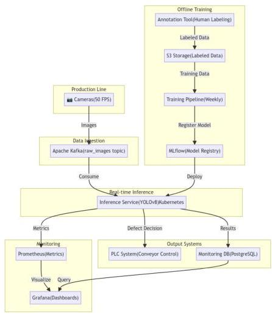
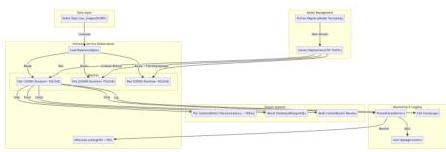
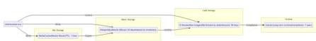

# Пример отчета: Проектирование системы контроля качества на производстве

Курс: Проектирование систем машинного обучения

Студент: Иванов Иван Иванович

Группа: МЛ-2025

## 1. Введение и постановка задачи

Проектируется система для автоматического обнаружения дефектов в продуктах на высокоскоростной сборочной линии. Система должна в реальном времени анализировать изображения продуктов, поступающие с камер, и классифицировать их как «брак» или «норма».

### Бизнес-цели:

- Снижение доли брака: Уменьшить количество бракованных изделий, попадающих к конечному потребителю, на 95%.
- Оптимизация затрат: Сократить расходы на ручной контроль качества на 70%.
- Повышение производительности: Увеличить скорость производственной линии на 15% за счет автоматизации контроля.

### Требования к системе:

- Задержка (latency): Не более 150 мс на одно изображение.
- Пропускная способность (throughput): 50 изображений в секунду (соответствует скорости конвейера).

- Точность (precision) для класса «брак»: Не ниже 99% (минимизация пропуска брака).
- Полнота (recall) для класса «брак»: Не ниже 95%.

## Часть 1: Формулировка ML-задачи и выбор модели

### 1. Определение ML-задачи

Задачу можно сформулировать как бинарную классификацию изображений. Каждое изображение, полученное с камеры, должно быть отнесено к одному из двух классов: defect или no_defect.

- Входные данные: Изображения продуктов с конвейера в формате JPEG, разрешением 512x512 пикселей.
- Выходные данные: Вероятность принадлежности изображения к классу defect.
- Целевая переменная: Бинарная метка (1 для defect, 0 для no_defect).

### 2. Выбор модели

Рассмотрим два подхода:

#### 1. Классическая сверточная нейронная сеть (CNN) — ResNet50:

- Преимущества: Высокая точность в задачах классификации, наличие предобученных на ImageNet весов, что ускоряет обучение (transfer learning).
- Недостатки: Может быть вычислительно тяжелой для достижения низкой задержки. Не локализует дефект, а только классифицирует все изображение.

#### 2. Детектор объектов — YOLOv8 (You Only Look Once):

- Преимущества: Очень высокая скорость работы, позволяет не только классифицировать, но и локализовать дефект на изображении (возвращает bounding box). Это полезно для анализа причин брака.

- Недостатки: Может потребовать более сложной разметки данных (bounding box) — в вместо простых меток).

Выбор: Для данной задачи выбираем YOLOv8. Несмотря на более сложную разметку, возможность локализации дефекта предоставляет ценную дополнительную информацию для инженеров по качеству. Современные версии YOLO оптимизированы для работы в реальном времени, что позволяет уложиться в требование по задержке.

# Часть 2: Проектирование архитектуры

## 1. Высокоуровневая архитектура системы

Высокоуровневая архитектура показывает взаимодействие всех основных компонентов системы: от сбора данных с камер до развертывания обученной модели и мониторинга.

### Ключевые компоненты:

- Cameras: Высокоскоростные камеры на конвейере, захватывающие изображения с частотой 50 FPS.
- Kafka: Распределенная очередь сообщений для буферизации потока изображений.
- Inference Service: Основной сервис, содержащий модель YOLOv8, развернутый в Kubernetes.
- PLC System: Система управления конвейером, получающая решения о браке.
- Monitoring DB: База данных для хранения результатов и статистики.
- Training Pipeline: Автоматизированный конвейер обучения.
- MLflow: Система управления моделями.
- Prometheus &amp; Grafana: Мониторинг метрик.

Архитектурные диаграммы системы контроля качества

1. Высокоуровневая архитектура системы

2. Архитектура Data Pipeline

3. Архитектура Training Pipeline

4. Архитектура Inference Pipeline (Serving)

5. Архитектура хранилища данных (Data Storage)

# 2. Архитектура Data Pipeline

Data Pipeline описывает процесс сбора, разметки и подготовки данных для обучения моделей.

## Этапы:

1. Сбор данных: Камеры отправляют изображения в Kafka для буферизации.
2. Архивирование: Сырые изображения архивируются в S3.
3. Разметка: Операторы вручную размечают дефекты в веб-интерфейсе.

4. Обработка: Spark-джоб еженедельно забирает размеченные данные, применяет аугментацию.
5. Хранилище признаков: Обработанные данные сохраняются в Feature Store.

## 3. Архитектура Training Pipeline

Training Pipeline показывает автоматизированный процесс обучения моделей с триггерами, валидацией и развертыванием.

**Процесс:**

1. Триггер: Pipeline запускается при коммите в Git или по расписанию (еженедельно).
2. Подготовка данных: Данные загружаются из Feature Store и разбиваются на выборки (70/15/15).
3. Обучение: Модель YOLOv8 обучается на GPU-кластере с логированием в MLflow.
4. Валидация: Проверка метрик на тестовой выборке.
5. Регистрация: Успешная модель регистрируется в MLflow Model Registry.
6. Развертывание: Модель упаковывается в Docker и развертывается в Kubernetes.

## 4. Архитектура Inference Pipeline (Serving)

Inference Pipeline описывает систему реального времени для обработки изображений с конвейера.

**Компоненты:**

- Load Balancer: Распределяет нагрузку между подами Kubernetes.
- Inference Pods: Каждый под содержит модель YOLOv8 в формате ONNX.
- HPA: Автоматически масштабирует количество подов при увеличении нагрузки.
- PLC System: Получает решения о браке с задержкой менее 150 мс.
- Result Database: Хранит результаты инференса.
- Redis Cache: Кэширует последние результаты.

- Prometheus &amp; ELK: Мониторинг и логирование.
- Canary Deployment: Новые версии моделей сначала тестируются на 10% трафика.

## Часть 3: Расчёты и нефункциональные требования

### 1. Расчёт требований к хранилищу

#### Объем одного изображения:

- Разрешение: 512x512 пикселей
- Каналы: 3 (RGB)
- Размер: 512 × 512 × 3 = 0.786 МБ

#### Поток данных в секунду:

- 50 изображений/сек × 0.786 МБ/изображение = 39.3 МБ/с

#### Объем данных в день:

- 39.3 МБ/с × 3600 с/час × 24 часа/день = 3.4 ТБ/день

#### Требуемое хранилище:

- Сырые изображения (30 дней): 3.4 ТБ/день × 30 дней = 102 ТБ
- Размеченные данные: ~10 ТБ
- Модели и артефакты: ~100 ГБ
- Итого: ~112 ТБ

### 2. Расчёт требований к пропускной способности

Требуемая пропускная способность: 50 RPS

#### Производительность одного инстанса:

- Один инстанс на GPU T4 может обрабатывать ~25 RPS

#### Количество инстансов:

- 50 RPS ÷ 25 RPS/инстанс = 2 инстанса
- С учетом отказоустойчивости: 3 инстанса

## Требования к сети:

- Входящий трафик: 50 RPS × 0.786 МБ = 39.3 МБ/с
- Исходящий трафик: 50 RPS × 0.01 МБ (результаты) = 0.5 МБ/с

## 3. Масштабируемость и надёжность

### Масштабируемость:

- Горизонтальное масштабирование: Inference Service развернут в Kubernetes и может автоматически масштабироваться с помощью HPA при увеличении нагрузки (CPU &gt; 70%).
- Масштабирование данных: Kafka и S3 являются распределенными системами и легко масштабируются.
- Масштабирование обучения: GPU-кластер может быть расширен для параллельного обучения нескольких моделей.

### Надёжность:

- Репликация: Запуск нескольких реплик Inference Service в Kubernetes.
- Health Checks: Настроены liveness и readiness пробы для автоматического перезапуска нездоровых подов.
- Резервное копирование: Регулярное резервное копирование базы данных и моделей.
- Мониторинг: Prometheus и Grafana используются для мониторинга состояния системы и оповещения в случае сбоев.
- Восстановление после сбоев: Использование Kubernetes для автоматического восстановления после сбоев узлов.

Список использованных источников

1. Redmon, J., &amp; Farhadi, A. (2018). YOLOv3: An Incremental Improvement. arXiv preprint arXiv:1804.02767.
2. ML System Design Interview. Alex Xu, Ali Aminian.
3. Kubernetes Documentation. https://kubernetes.io/docs/
4. Apache Kafka Documentation. https://kafka.apache.org/documentation/

