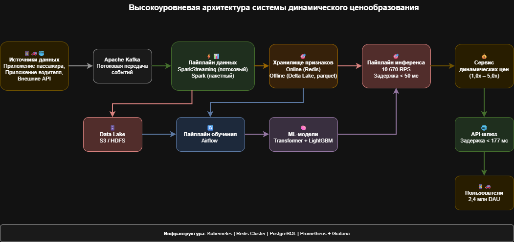
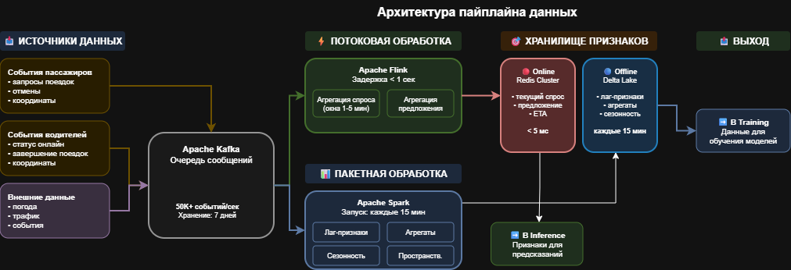
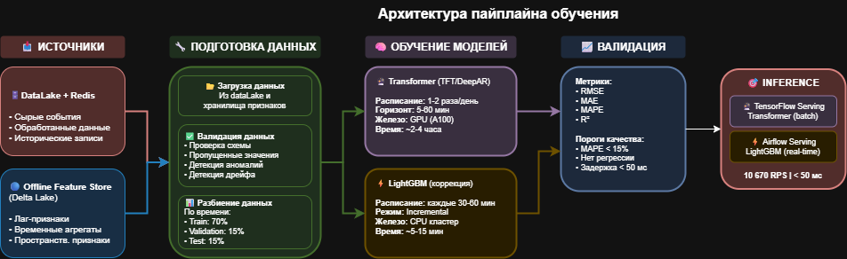
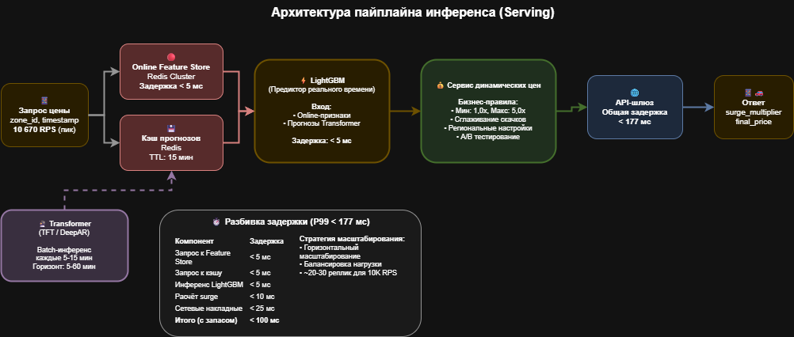

# Часть 1. Формулировка ML-задачи и выбор моделей

## 1. Бизнес-задача

Целью проекта является разработка системы динамического ценообразования для сервиса райдшеринга. Основная функция системы — прогнозировать дисбаланс спроса и предложения по геозонам города и корректировать тарифы в реальном времени для поддержания баланса рынка. Это позволяет снижать среднее время ожидания пассажиров, увеличивать долю обслуженных запросов (fill rate), оптимизировать загрузку водителей и стабильно повышать общую выручку платформы.

---

## 2. Формулировка задачи

### Тип задачи  
Проблема относится к классу задач регрессии. Модель должна прогнозировать будущие значения спроса и предложения на коротком горизонте (5–15 минут), а затем — итоговый дисбаланс между ними, который определяет величину динамического тарифного множителя (surge multiplier).

### Таргет  
Основной целевой переменной является:

- **demand_supply_gap(t+5)** — прогноз разницы между количеством запросов пассажиров (demand) и количеством доступных водителей (supply) в выбранной геозоне через 5 минут.

Альтернативно, прогноз спроса и предложения может быть выполнен отдельными моделями.

### Данные для обучения

Используются следующие группы признаков:

- **Исторические признаки:** количество запросов, количество доступных водителей, отмены, фактические уровни surge, время подачи и ожидания.
- **Пространственные признаки:** идентификатор зоны, плотность населения, связи с соседними зонами.
- **Временные признаки:** час дня, день недели, праздники, аномальные периоды.
- **Контекстные признаки:** погодные данные, наличие массовых мероприятий, трафик.
- **Streaming-признаки:** быстрые агрегаты за последние 1–5 минут — изменение спроса, отток или приток водителей, всплески запросов.
- **Системные признаки:** текущее ETA, коэффициент отмен, уровень конкуренции.

Эти данные позволяют моделировать как долгосрочные паттерны динамики рынка, так и краткосрочные колебания.

---

## 3. Выбор моделей

### 3.1. LightGBM (градиентный бустинг)

**Преимущества:**
- высокая скорость обучения и инференса;
- возможность дообучения (warm-start), что подходит для частых обновлений в реальном времени;
- устойчивость к шуму и разнородным табличным данным;
- простая интеграция в продакшен.

**Недостатки:**
- требуется ручное формирование lag-фичей и агрегатов;
- ограниченная способность моделировать долгосрочные временные зависимости;
- чувствительность к резким структурным изменениям рынка без частого переобучения.

LightGBM подходит как основная модель для оперативной коррекции динамической цены в реальном времени.

---

### 3.2. Transformer-архитектуры (DeepAR / Temporal Fusion Transformer)

**Преимущества:**
- способность моделировать сложные сезонные, недельные и суточные паттерны;
- эффективная работа с многомерными временными рядами;
- устойчивость к нерегулярным или сложным колебаниям спроса;
- возможность прогнозирования на горизонте 5–60 минут.

**Недостатки:**
- высокая вычислительная стоимость обучения;
- ограниченная частота переобучения (обычно 1–2 раза в сутки);
- сложная эксплуатация и необходимость GPU-ресурсов;
- меньшая гибкость в использовании сверхчастых окон (1–5 секунд).

Эти модели подходят для формирования долгосрочного и среднесрочного прогноза спроса и предложения.

---

## 4. Выбор комбинированной двухуровневой архитектуры

Для обеспечения высокой точности прогноза и способности адаптироваться к изменениям рынка в режиме реального времени применяется двухуровневая модель:

### Уровень 1: Модель долгосрочного прогноза (Transformer / DeepAR / TFT)

Задачи:
- прогнозирование спроса и предложения по зонам на горизонте 5–15 минут;
- моделирование недельных и суточных паттернов рынка;
- сглаживание шумов и пиков.

Входные данные:
- исторические временные ряды,
- погодные и календарные признаки,
- пространственные признаки зон,
- данные о событиях,
- агрегаты с частотой 5–15 минут.

Выходные данные:
- прогноз спроса,
- прогноз предложения,
- первичный показатель дисбаланса.

---

### Уровень 2: Модель оперативной коррекции (LightGBM / CatBoost)

Задачи:
- учёт данных в реальном времени (1–30 секунд),
- коррекция прогноза трансформера с учётом локальных всплесков,
- формирование окончательного значения дисбаланса,
- генерация surge-множителя.

Входные данные:
- прогнозы трансформер-модели,
- быстрые агрегаты спроса и предложения,
- текущая статистика отмен,
- ETA в зоне,
- приток/отток водителей,
- локальные контекстные факторы.

---

### Преимущества гибридной архитектуры

- **Высокая точность:** трансформеры обеспечивают точный прогноз трендов, бустинги корректируют его на основе актуального состояния рынка.
- **Быстрая реакция:** LightGBM позволяет изменять цены с задержкой < 100 мс.
- **Адаптивность:** GBDT может переобучаться каждые 30–60 минут.
- **Устойчивость:** трансформер сглаживает долгосрочный шум, а GBDT компенсирует локальные пики.
- **Гибкость:** модели независимы, легко масштабируются и обновляются.

---

Таким образом, оптимальным решением для задачи прогнозирования спроса, предложения и динамического ценообразования является комбинированная двухуровневая архитектура, объединяющая преимущества моделей семейства Transformer и градиентного бустинга (LightGBM).

---

# Часть 2. Проектирование архитектуры

## 2.1. Высокоуровневая архитектура системы

Общая архитектура системы динамического ценообразования включает следующие ключевые компоненты: источники данных (приложения пассажиров и водителей, внешние API), пайплайн обработки данных (потоковый и пакетный), хранилище признаков, ML-модели (Transformer + LightGBM), сервис инференса и сервис динамических цен.

---

## 2.2. Архитектура пайплайна данных (Data Pipeline)

Пайплайн данных состоит из двух ветвей:
- **Потоковая обработка (Apache Flink)** — обработка событий в реальном времени с задержкой < 1 секунды, генерация online-признаков (текущий спрос, предложение, ETA, детекция всплесков).
- **Пакетная обработка (Apache Spark)** — построение исторических признаков (лаг-признаки, агрегаты, сезонность), запуск каждые 15 минут.

Данные поступают через Apache Kafka и сохраняются в двухуровневое хранилище признаков (Online — Redis, Offline — Delta Lake) и озеро данных (S3/HDFS).

---

## 2.3. Архитектура пайплайна обучения (Training Pipeline)

Пайплайн обучения включает:
- **Подготовка данных** — загрузка из озера данных и хранилища признаков, валидация, разбиение на train/validation/test.
- **Обучение моделей** — Transformer (1–2 раза в день, GPU) и LightGBM (каждые 30–60 минут, инкрементально).
- **Валидация** — проверка метрик (RMSE, MAE, MAPE < 15%).
- **Реестр моделей (MLflow)** — версионирование и управление жизненным циклом моделей.
- **Развёртывание** — канареечный деплой с автоматическим откатом при деградации.

---

## 2.4. Архитектура пайплайна инференса (Inference Pipeline)

Инференс обеспечивает обработку запросов с пиковой нагрузкой 10 670 RPS и общей задержкой < 177 мс:
- **Transformer** — периодический batch-инференс каждые 5–15 минут, результаты кэшируются в Redis.
- **LightGBM** — real-time инференс с задержкой < 5 мс, использует online-признаки и прогнозы Transformer.
- **Сервис динамических цен** — применяет бизнес-правила (множитель 1,0x–5,0x, сглаживание, A/B тесты).

---

# Часть 3. Расчёты и нефункциональные требования

## 3.1. Исходные данные

| Параметр | Значение |
|----------|----------|
| Активные пользователи в день (DAU) | 2 432 132 |
| Пиковая нагрузка (RPS) | 10 670 запросов/сек |
| Максимальная задержка ответа | 177 мс |
| Количество геозон | ~500 |
| Горизонт хранения данных | 90 дней |

---

## 3.2. Расчёт требований к хранилищу

### 3.2.1. Online Feature Store (Redis)

Хранит актуальные признаки для real-time инференса.

**Расчёт:**
- 500 зон × 50 признаков × 8 байт = ~200 КБ
- С учётом TTL (5 временных точек) и репликации: **~3 ГБ RAM** (Redis Cluster из 3 узлов)

### 3.2.2. Offline Feature Store и Data Lake (S3)

Хранит исторические данные для обучения моделей.

**Расчёт:**
- Сырые события: ~2.4M DAU × 3 запроса × 500 байт = **~3.6 ГБ/день**
- За 90 дней с учётом сжатия: **~100 ГБ**
- Агрегированные признаки за 90 дней: **~4 ГБ**
- Модели и артефакты: **~10 ГБ**

**Итого Offline-хранилище: ~500 ГБ** (с запасом на рост — **1 ТБ**)

### 3.2.3. Сводная таблица

| Компонент | Объём |
|-----------|-------|
| Online Feature Store (Redis) | 3 ГБ RAM |
| Offline Feature Store (S3) | 1 ТБ |
| Data Lake (сырые события) | 3 ТБ |
| Логи и мониторинг | 500 ГБ |
| **Итого** | **~5 ТБ** |

---

## 3.3. Расчёт требований к пропускной способности

### 3.3.1. Бюджет задержки (Latency Budget)

Требование: ответ за **177 мс**.

| Этап | Задержка |
|------|----------|
| Сетевые вызовы | ~40 мс |
| Запрос к Redis (признаки + кэш) | ~10 мс |
| Инференс LightGBM | ~5 мс |
| Бизнес-логика | ~15 мс |
| **Итого** | **~70 мс** |

**Вывод:** Запас по задержке составляет ~100 мс (60%).

### 3.3.2. Расчёт реплик сервиса инференса

- Время обработки одного запроса: ~20 мс
- Throughput одного пода: ~50 RPS
- Для 10 670 RPS требуется: 10 670 / 50 ≈ **215 подов**
- С запасом 30%: **~280 подов**

**Рекомендация:** Kubernetes с автоскейлингом (HPA), min: 50, max: 300 реплик.

### 3.3.3. Streaming и Batch Pipeline

| Компонент | Конфигурация |
|-----------|--------------|
| Apache Kafka | 3 брокера, 12 партиций |
| Apache Flink | 4 TaskManagers |
| Apache Spark | 8 executors, запуск каждые 15 мин |

---

## 3.4. Масштабируемость и надёжность

### 3.4.1. Стратегия масштабирования

Все компоненты системы поддерживают **горизонтальное масштабирование**:
- **Inference Service** — автоскейлинг через Kubernetes HPA
- **Redis** — добавление шардов в кластер
- **Kafka** — добавление брокеров и партиций
- **Flink/Spark** — добавление воркеров

### 3.4.2. Отказоустойчивость

**Основные механизмы:**

1. **Репликация** — все критичные компоненты имеют минимум 3 реплики
2. **Multi-AZ deployment** — распределение по нескольким зонам доступности
3. **Circuit Breaker** — при сбое возвращается базовый множитель (1.0x)
4. **Graceful Degradation:**
   - При сбое Transformer → используются кэшированные прогнозы
   - При сбое Feature Store → используются default-значения

### 3.4.3. Disaster Recovery

| Параметр | Значение |
|----------|----------|
| RTO (время восстановления) | < 15 минут |
| RPO (допустимая потеря данных) | < 5 минут |

Обеспечивается резервным регионом (warm standby) с репликацией данных.

---

## 3.5. Итоговая сводка

| Требование | Значение | Статус |
|------------|----------|--------|
| Latency | < 177 мс | ✅ ~70 мс |
| Throughput | 10 670 RPS | ✅ до 15 000 RPS |
| Availability | 99.9% | ✅ Multi-AZ + репликация |
| Хранилище | — | ✅ ~5 ТБ |
| Масштабируемость | ×3 | ✅ Горизонтальное |

---
