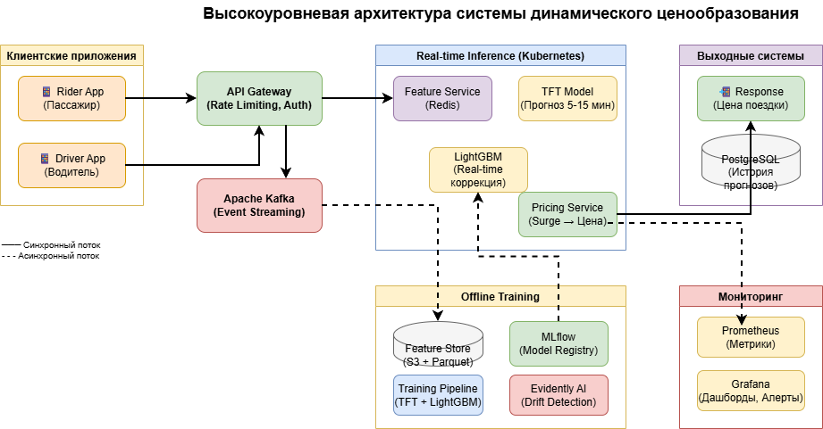
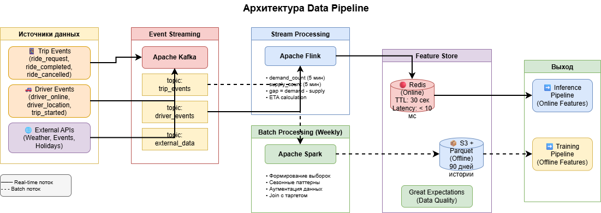
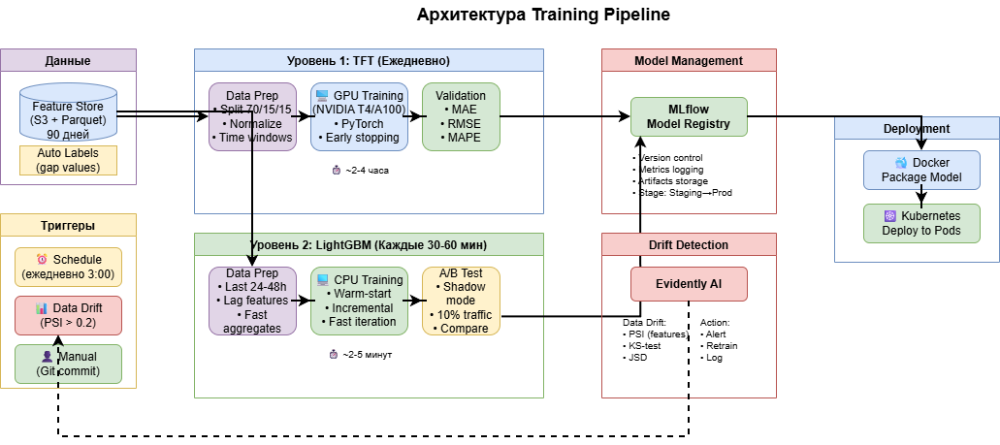
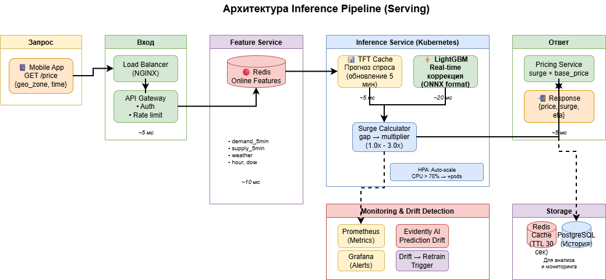

# Проектирование системы динамического ценообразования для райдшеринга

**Курс:** Проектирование систем машинного обучения

**Студент:** Муханов Дмитрий, Касьянов Илья

**Группа:** М8О-209СВ-24, М8О-214СВ-24

---

## Введение и постановка задачи

Проектируется система для прогнозирования спроса и предложения с целью установки динамических (пиковых) цен в сервисе райдшеринга. Система должна в реальном времени анализировать потоки данных о запросах пассажиров и доступности водителей, прогнозировать дисбаланс и корректировать тарифы для оптимизации работы платформы.

### Бизнес-цели:

- **Повышение fill rate:** Увеличить долю обслуженных запросов на 15% за счёт динамической балансировки спроса и предложения.
- **Снижение времени ожидания:** Уменьшить среднее время подачи машины на 20%.
- **Увеличение выручки:** Повысить общую выручку платформы на 10–15% за счёт оптимального ценообразования.

### Требования к системе:

- **Задержка (latency):** Не более 177 мс на один запрос.
- **Пропускная способность (throughput):** 10,670 запросов в секунду (пиковая нагрузка).
- **Активные пользователи:** 2,432,132 DAU.
- **Масштабируемость:** Система должна поддерживать рост нагрузки в 2–3 раза.
- **Отказоустойчивость:** Доступность не менее 99.9%.

---

# Часть 1. Формулировка ML-задачи и выбор моделей

## 1. Бизнес-задача

Целью проекта является разработка системы динамического ценообразования для сервиса райдшеринга. Основная функция системы — прогнозировать дисбаланс спроса и предложения по геозонам города и корректировать тарифы в реальном времени для поддержания баланса рынка. Это позволяет снижать среднее время ожидания пассажиров, увеличивать долю обслуженных запросов (fill rate), оптимизировать загрузку водителей и стабильно повышать общую выручку платформы.

---

## 2. Формулировка задачи

### Тип задачи  
Проблема относится к классу задач регрессии. Модель должна прогнозировать будущие значения спроса и предложения на коротком горизонте (5–15 минут), а затем — итоговый дисбаланс между ними, который определяет величину динамического тарифного множителя (surge multiplier).

### Таргет  
Основной целевой переменной является:

- **demand_supply_gap(t+5)** — прогноз разницы между количеством запросов пассажиров (demand) и количеством доступных водителей (supply) в выбранной геозоне через 5 минут.

Альтернативно, прогноз спроса и предложения может быть выполнен отдельными моделями.

### Данные для обучения

Используются следующие группы признаков:

- **Исторические признаки:** количество запросов, количество доступных водителей, отмены, фактические уровни surge, время подачи и ожидания.
- **Пространственные признаки:** идентификатор зоны, плотность населения, связи с соседними зонами.
- **Временные признаки:** час дня, день недели, праздники, аномальные периоды.
- **Контекстные признаки:** погодные данные, наличие массовых мероприятий, трафик.
- **Streaming-признаки:** быстрые агрегаты за последние 1–5 минут — изменение спроса, отток или приток водителей, всплески запросов.
- **Системные признаки:** текущее ETA, коэффициент отмен, уровень конкуренции.

Эти данные позволяют моделировать как долгосрочные паттерны динамики рынка, так и краткосрочные колебания.

---

## 3. Выбор моделей

### 3.1. LightGBM (градиентный бустинг)

**Преимущества:**
- высокая скорость обучения и инференса;
- возможность дообучения (warm-start), что подходит для частых обновлений в реальном времени;
- устойчивость к шуму и разнородным табличным данным;
- простая интеграция в продакшен.

**Недостатки:**
- требуется ручное формирование lag-фичей и агрегатов;
- ограниченная способность моделировать долгосрочные временные зависимости;
- чувствительность к резким структурным изменениям рынка без частого переобучения.

LightGBM подходит как основная модель для оперативной коррекции динамической цены в реальном времени.

---

### 3.2. Transformer-архитектуры (DeepAR / Temporal Fusion Transformer)

**Преимущества:**
- способность моделировать сложные сезонные, недельные и суточные паттерны;
- эффективная работа с многомерными временными рядами;
- устойчивость к нерегулярным или сложным колебаниям спроса;
- возможность прогнозирования на горизонте 5–60 минут.

**Недостатки:**
- высокая вычислительная стоимость обучения;
- ограниченная частота переобучения (обычно 1–2 раза в сутки);
- сложная эксплуатация и необходимость GPU-ресурсов;
- меньшая гибкость в использовании сверхчастых окон (1–5 секунд).

Эти модели подходят для формирования долгосрочного и среднесрочного прогноза спроса и предложения.

---

## 4. Выбор комбинированной двухуровневой архитектуры

Для обеспечения высокой точности прогноза и способности адаптироваться к изменениям рынка в режиме реального времени применяется двухуровневая модель:

### Уровень 1: Модель долгосрочного прогноза (Transformer / DeepAR / TFT)

Задачи:
- прогнозирование спроса и предложения по зонам на горизонте 5–15 минут;
- моделирование недельных и суточных паттернов рынка;
- сглаживание шумов и пиков.

Входные данные:
- исторические временные ряды,
- погодные и календарные признаки,
- пространственные признаки зон,
- данные о событиях,
- агрегаты с частотой 5–15 минут.

Выходные данные:
- прогноз спроса,
- прогноз предложения,
- первичный показатель дисбаланса.

---

### Уровень 2: Модель оперативной коррекции (LightGBM / CatBoost)

Задачи:
- учёт данных в реальном времени (1–30 секунд),
- коррекция прогноза трансформера с учётом локальных всплесков,
- формирование окончательного значения дисбаланса,
- генерация surge-множителя.

Входные данные:
- прогнозы трансформер-модели,
- быстрые агрегаты спроса и предложения,
- текущая статистика отмен,
- ETA в зоне,
- приток/отток водителей,
- локальные контекстные факторы.

---

### Преимущества гибридной архитектуры

- **Высокая точность:** трансформеры обеспечивают точный прогноз трендов, бустинги корректируют его на основе актуального состояния рынка.
- **Быстрая реакция:** LightGBM позволяет изменять цены с задержкой < 100 мс.
- **Адаптивность:** GBDT может переобучаться каждые 30–60 минут.
- **Устойчивость:** трансформер сглаживает долгосрочный шум, а GBDT компенсирует локальные пики.
- **Гибкость:** модели независимы, легко масштабируются и обновляются.

---

Таким образом, оптимальным решением для задачи прогнозирования спроса, предложения и динамического ценообразования является комбинированная двухуровневая архитектура, объединяющая преимущества моделей семейства Transformer и градиентного бустинга (LightGBM).

---

# Часть 2. Проектирование архитектуры

## 1. Высокоуровневая архитектура системы

Высокоуровневая архитектура показывает взаимодействие всех основных компонентов системы динамического ценообразования: от сбора данных о поездках до формирования surge-множителя и мониторинга.

### Ключевые компоненты:

- **Mobile Apps (Rider/Driver):** Мобильные приложения пассажиров и водителей, генерирующие запросы на поездки и данные о местоположении.
- **API Gateway:** Точка входа для всех запросов, маршрутизация и rate limiting.
- **Apache Kafka:** Распределённая очередь сообщений для буферизации потоков событий (запросы, GPS-координаты, статусы водителей).
- **Feature Store (Redis + PostgreSQL):** Хранилище признаков для быстрого доступа к агрегатам в реальном времени.
- **Inference Service:** Двухуровневый сервис прогнозирования (TFT + LightGBM), развёрнутый в Kubernetes.
- **Pricing Service:** Сервис расчёта итоговой цены на основе surge-множителя.
- **Monitoring (Prometheus & Grafana):** Мониторинг метрик системы и качества модели.
- **Training Pipeline:** Автоматизированный конвейер обучения моделей.
- **MLflow:** Система управления версиями моделей и экспериментами.

### Архитектурная диаграмма:



---

## 2. Архитектура Data Pipeline

Data Pipeline описывает процесс сбора, обработки и подготовки данных для обучения моделей прогнозирования спроса и предложения.

### Источники данных:

1. **Trip Events:** События о запросах на поездки, завершённых поездках, отменах из приложения для пользователя.
2. **Driver Events:** Данные о местоположении водителей, статусах (онлайн/офлайн/занят) из приложения для водителя.
3. **External Data:** Погодные данные, события города, праздники со сторонних API.

### Автоматическая разметка данных (Labeling)

> В данной задаче прогнозирования спроса/предложения **разметка происходит полностью автоматически**.

#### Механизм автоматического формирования таргета:

Таргет вычисляется из реальных событий, которые система логирует автоматически:

1. **Demand (спрос):** Количество запросов на поездки за временное окно.
   - Источник: события `ride_request` из приложения пассажира
   - Расчёт: `demand(t, zone) = COUNT(ride_requests)` за последние 5 минут в геозоне

2. **Supply (предложение):** Количество доступных водителей.
   - Источник: события `driver_online`, `driver_location`, `trip_ended` из приложения водителя
   - Расчёт: `supply(t, zone) = COUNT(drivers WHERE status = 'available')` в геозоне

3. **Таргет для модели:**
   ```
   demand_supply_gap(t+5) = demand(t+5) - supply(t+5)
   ```
   Через 5 минут система автоматически узнаёт фактические значения demand и supply из логов событий — это и становится таргетом для обучения.
   
### Этапы обработки:

1. **Сбор данных:** Все события поступают в Apache Kafka в соответствующие топики.
2. **Stream Processing:** Apache Flink агрегирует данные в реальном времени:
   - Подсчёт запросов за последние 15 минут по геозонам
   - Подсчёт доступных водителей по геозонам
   - Расчёт ETA и времени подачи
3. **Batch Processing:** Apache Spark еженедельно обрабатывает исторические данные:
   - Формирование обучающих выборок
   - Расчёт сезонных паттернов
   - Аугментация данных (добавление синтетических примеров для редких событий)
4. **Feature Store:** Признаки сохраняются в двух слоях:
   - **Online (Redis):** Быстрые агрегаты для инференса (< 10 мс)
   - **Offline (S3 + Parquet):** Исторические данные для обучения
5. **Data Quality:** Great Expectations проверяет качество данных перед использованием.

### Архитектурная диаграмма:



---

## 3. Архитектура Training Pipeline

Training Pipeline показывает автоматизированный процесс обучения двухуровневой модели с валидацией и развёртыванием.

### Процесс обучения:

#### Уровень 1: Temporal Fusion Transformer (TFT)

1. **Триггер:** Запуск по расписанию (ежедневно в 3:00 UTC) или при значительном дрейфе данных.
2. **Подготовка данных:** 
   - Загрузка данных из Feature Store (последние 90 дней)
   - Разбиение: 70% train / 15% validation / 15% test
   - Нормализация и формирование временных окон
3. **Обучение:** 
   - GPU-кластер (NVIDIA T4/A100)
   - Логирование метрик в MLflow
   - Early stopping по validation loss
4. **Валидация:** 
   - Проверка MAE, RMSE, MAPE на тестовой выборке
   - Сравнение с baseline (предыдущая модель)
5. **Регистрация:** Успешная модель регистрируется в MLflow Model Registry.

#### Уровень 2: LightGBM

1. **Триггер:** Каждые 30–60 минут или при обнаружении дрейфа.
2. **Подготовка данных:**
   - Загрузка данных за последние 24–48 часов
   - Формирование lag-признаков и быстрых агрегатов
3. **Обучение:** 
   - CPU-кластер (быстрое обучение ~2–5 минут)
   - Warm-start от предыдущей модели
4. **Валидация:** A/B тестирование на shadow traffic.
5. **Деплой:** Модель упаковывается в Docker и развёртывается в Kubernetes.

### Архитектурная диаграмма:



---

## 4. Архитектура Inference Pipeline (Serving)

Inference Pipeline описывает систему реального времени для расчёта surge-множителя с задержкой менее 177 мс.

### Компоненты:

- **Load Balancer (NGINX/Envoy):** Распределяет нагрузку между подами Kubernetes.
- **API Gateway:** Аутентификация, rate limiting, маршрутизация.
- **Feature Service:** Получает актуальные признаки из Redis (< 5 мс).
- **Inference Pods:** 
  - TFT Model: Предобученные прогнозы спроса/предложения (обновляются каждые 5 минут)
  - LightGBM Model: Real-time коррекция и расчёт surge-множителя
- **Model Format:** ONNX для оптимизированного инференса.
- **HPA (Horizontal Pod Autoscaler):** Автоматическое масштабирование при CPU > 70%.
- **Redis Cache:** Кэширование результатов прогноза по геозонам (TTL = 30 сек).
- **Result Database (PostgreSQL):** Хранение истории прогнозов для анализа.

### Процесс обработки запроса:

1. Запрос от Mobile App → API Gateway (5 мс)
2. Получение признаков из Redis Feature Store (10 мс)
3. Загрузка кэшированного прогноза TFT (5 мс)
4. Инференс LightGBM для расчёта surge (20 мс)
5. Формирование ответа с ценой (5 мс)
6. **Общая задержка:** ~45–80 мс (запас до 177 мс)

### Архитектурная диаграмма:



---

# Часть 3. Расчёты и нефункциональные требования

## 1. Расчёт требований к хранилищу

### Исходные данные:

- **DAU:** 2,432,132 пользователей
- **Среднее количество запросов на пользователя:** ~3 запроса/день
- **Общее количество запросов в день:** 2,432,132 × 3 ≈ **7,300,000 запросов/день**

### Объём данных на один запрос:

| Тип данных | Размер |
|------------|--------|
| Метаданные запроса (JSON) | ~500 байт |
| GPS-координаты (10 точек) | ~200 байт |
| Признаки для модели | ~1 КБ |
| Результат прогноза | ~100 байт |
| **Итого на запрос** | **~1.8 КБ** |

### Ежедневный объём данных:

- **События запросов:** 7,300,000 × 1.8 КБ = **13.1 ГБ/день**
- **GPS-данные водителей:** ~500,000 водителей × 1440 мин × 100 байт = **72 ГБ/день**
- **Агрегаты по геозонам:** ~1000 зон × 1440 мин × 500 байт = **0.7 ГБ/день**
- **Логи и метрики:** ~5 ГБ/день

**Итого в день:** ~91 ГБ/день

### Требуемое хранилище:

| Тип данных | Срок хранения | Объём |
|------------|---------------|-------|
| Сырые события (S3) | 90 дней | 91 ГБ × 90 = **8.2 ТБ** |
| Feature Store (Online) | Real-time | **50 ГБ** (Redis) |
| Feature Store (Offline) | 1 год | **33 ТБ** |
| Модели и артефакты | Все версии | **500 ГБ** |
| Логи и метрики | 30 дней | **150 ГБ** |
| **Итого** | | **~42 ТБ** |

---

## 2. Расчёт требований к пропускной способности

### Исходные данные:

- **Пиковая нагрузка:** 10,670 RPS
- **Требуемая задержка:** < 177 мс

### Производительность одного инстанса:

| Модель | Время инференса | RPS на инстанс |
|--------|-----------------|----------------|
| TFT (кэшированный прогноз) | 5 мс | N/A (batch) |
| LightGBM (ONNX) | 20 мс | ~50 RPS |

### Расчёт количества инстансов:

```
Требуемые инстансы = Пиковый RPS / RPS на инстанс
                   = 10,670 / 50
                   = 214 инстансов
```

С учётом отказоустойчивости (+20%): **257 инстансов**

### Конфигурация инстансов:

| Компонент | CPU | RAM | Количество |
|-----------|-----|-----|------------|
| Inference Pod (LightGBM) | 2 vCPU | 4 ГБ | 257 |
| TFT Batch Service | 4 vCPU + GPU | 16 ГБ | 10 |
| Feature Service | 2 vCPU | 8 ГБ | 20 |
| API Gateway | 2 vCPU | 4 ГБ | 10 |

### Требования к сети:

- **Входящий трафик:** 10,670 RPS × 2 КБ = **21.3 МБ/с**
- **Исходящий трафик:** 10,670 RPS × 0.5 КБ = **5.3 МБ/с**
- **Внутренний трафик (Feature Store):** ~100 МБ/с

---

## 3. Масштабируемость и надёжность

### Масштабируемость:

#### Горизонтальное масштабирование:

- **Inference Service:** Развёрнут в Kubernetes с HPA. Автоматическое масштабирование при:
  - CPU > 70%
  - Latency P99 > 150 мс
  - RPS > 80% от capacity
- **Feature Store (Redis):** Кластер с шардированием по геозонам.
- **Kafka:** Партиционирование топиков по geo_zone_id для параллельной обработки.

#### Масштабирование данных:

- **S3:** Автоматически масштабируется.
- **PostgreSQL:** Read replicas для аналитических запросов.

#### Репликация и отказоустойчивость:

- **Kubernetes:** Минимум 3 реплики каждого сервиса в разных availability zones.
- **Redis Cluster:** 6 узлов (3 master + 3 replica).
- **Kafka:** Replication factor = 3.

#### Мониторинг и алертинг:

| Метрика | Порог | Действие |
|---------|-------|----------|
| Latency P99 | > 150 мс | Scale up + Alert |
| Error Rate | > 1% | Alert + Rollback |
| Model Drift | > 10% MAPE | Retrain trigger |
| CPU Usage | > 80% | Scale up |
---
